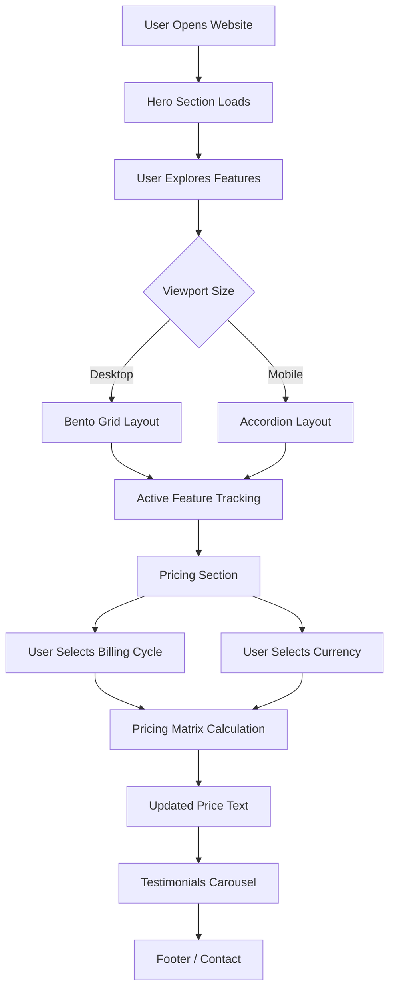
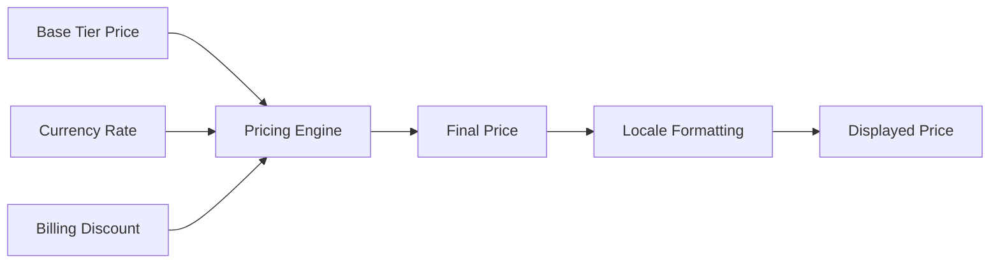
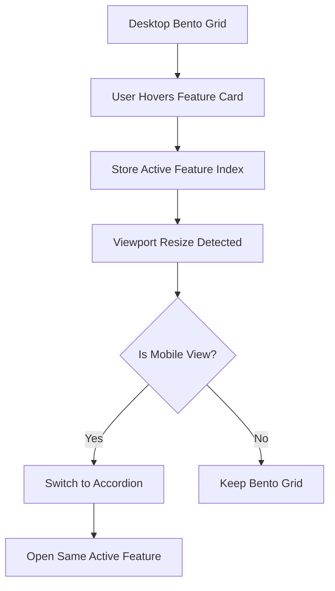

# NexaAI – Next Gen AI Platform

A premium, responsive SaaS landing page for an AI automation platform, built with React and Vite.

Live Site: https://nextinvo.netlify.app/

---

## Project Overview

NexaAI is a modern AI SaaS landing page designed to demonstrate strong frontend architecture, responsive UI design, dynamic pricing logic, semantic HTML, accessibility, and native CSS-based motion.

The project was created for the Next-Gen AI Platform Speed Run challenge. The goal was to build a polished landing page that naturally includes:

- Hero section
- Technical feature showcase
- Matrix-driven pricing
- Responsive Bento Grid to Accordion transformation
- Social proof section
- SEO-friendly and semantic structure
- Smooth CSS animations without external animation libraries

---

## Live Demo

https://nextinvo.netlify.app/

---

## Tech Stack

- React
- Vite
- JavaScript
- HTML5
- CSS3
- Bootstrap Icons
- Custom CSS
- Netlify Deployment

---

## Core Features

### 1. Hero Section

The hero section introduces the AI automation platform with:

- Premium SaaS-style layout
- Glassmorphism dashboard card
- Animated background grid
- Floating notification cards
- CTA buttons
- Responsive design

---

### 2. Feature Showcase

The feature section uses a Bento Grid layout on desktop and converts into an Accordion layout on mobile.

Key points:

- Desktop: Bento Grid
- Mobile: Accordion
- Active feature index is preserved during viewport resize
- Icons are loaded from the provided SVG assets
- Hover and focus interactions are handled using CSS transitions

---

### 3. Pricing Engine

The pricing section uses a dynamic matrix-based pricing system.

Supported billing cycles:

- Monthly
- Annual with 20% discount

Supported currencies:

- USD
- INR
- EUR

Pricing is calculated dynamically using:

- Base tier price
- Currency rate
- Billing discount
- Formatting locale

No pricing values are hardcoded directly inside the UI.

---

### 4. Testimonials Carousel

The testimonials section includes:

- Auto-scrolling testimonial cards
- Infinite marquee-style carousel
- Pause on hover
- Responsive card sizing
- Clean social proof layout

---

### 5. Responsive Design

The layout is optimized for:

- Desktop
- Laptop
- Tablet
- Mobile

The UI avoids horizontal overflow and adapts section spacing, grid columns, typography, and navigation for smaller screens.

---

## Project Flow



---

## Pricing Calculation Flow



Formula:

```text
Final Price = Base Rate × Currency Rate × Billing Discount
```

For annual billing:

```text
Annual Discount = 20%
Discount Multiplier = 0.8
```

---

## Bento to Accordion Flow



---

## Folder Structure

```text
src
│
├── assets
│   ├── fonts
│   ├── icons
│   ├── images
│   └── svg
│
├── components
│   ├── Common
│   │   └── Loader.jsx
│   │
│   ├── Header
│   │   ├── Header.jsx
│   │   └── Header.css
│   │
│   ├── Hero
│   │   ├── Hero.jsx
│   │   └── Hero.css
│   │
│   ├── Features
│   │   ├── Features.jsx
│   │   └── Features.css
│   │
│   ├── Pricing
│   │   ├── Pricing.jsx
│   │   ├── Pricing.css
│   │   ├── PriceCard.jsx
│   │   ├── PriceText.jsx
│   │   ├── BillingToggle.jsx
│   │   └── CurrencySwitcher.jsx
│   │
│   ├── Testimonials
│   │   ├── Testimonials.jsx
│   │   └── Testimonials.css
│   │
│   └── Footer
│       ├── Footer.jsx
│       └── Footer.css
│
├── data
│   ├── pricingMatrix.js
│   └── featuresData.js
│
├── styles
│   └── variables.css
│
├── utils
│   └── pricingUtils.js
│
├── App.jsx
├── main.jsx
└── index.css
```

---

## Important Files

### pricingMatrix.js

Stores all pricing configuration:

- Billing cycle data
- Currency rates
- Pricing tiers
- Feature lists

### pricingUtils.js

Contains the pricing calculation logic.

### Features.jsx

Handles:

- Bento Grid rendering
- Accordion rendering
- Active state tracking
- Resize-based state persistence

### PriceText.jsx

Handles isolated price text rendering and updates.

---

## Installation

Clone the repository:

```bash
git clone https://github.com/yourusername/next-gen-ai-platform.git
```

Navigate into the project:

```bash
cd next-gen-ai-platform
```

Install dependencies:

```bash
npm install
```

Run the development server:

```bash
npm run dev
```

Build for production:

```bash
npm run build
```

Preview production build:

```bash
npm run preview
```

---

## Deployment

The project is deployed on Netlify.

Live URL:

```text
https://nextinvo.netlify.app/
```

---

## SEO and Accessibility

Implemented:

- Semantic HTML structure
- Meta title and description
- Open Graph tags
- Twitter card tags
- Accessible buttons
- aria-expanded for accordion controls
- aria-labelledby for major sections
- Keyboard focus styling
- Reduced motion support

---

## Animation Strategy

The project uses only native CSS animations and transitions.

Implemented motion:

- Hero entrance animation
- Animated background grid
- Floating dashboard effect
- Card hover effects
- Accordion expand/collapse motion
- Testimonials marquee
- Scroll reveal animation

No external animation libraries are used.

---

## Challenge Requirements Covered

- React framework
- Public landing page
- Hero section
- Feature showcase
- Pricing tier matrix
- Social proof
- Monthly and Annual billing
- USD, INR, EUR currency switching
- Dynamic pricing calculation
- Bento Grid on desktop
- Accordion on mobile
- Active feature state persistence
- Semantic HTML
- SEO metadata
- Responsive breakpoint handling
- Custom CSS animations
- No external UI component library
- No runtime animation library

---

## Future Improvements

- Add authentication pages
- Connect pricing with real subscription APIs
- Add dashboard pages
- Add workflow builder UI
- Integrate real AI automation APIs
- Add analytics dashboard
- Add user account management
- Add dark/light theme switching
- Add backend integration

---

## Developer

Ravneet Kaur

---

## License

This project is created for learning, portfolio, and hackathon submission purposes.
